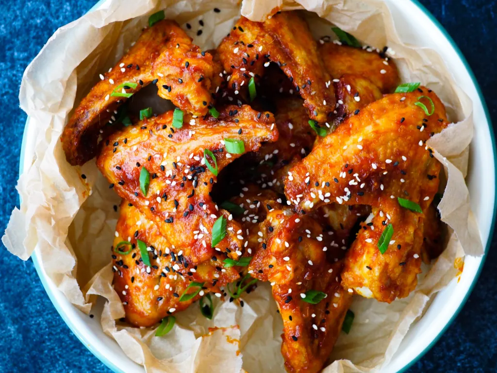

# les5.1
dit is les 5 voorbeeld
## test

1. Dep de kippenvleugels droog met een stuk keukenrol. Plaats in een schaal of grote plastic zak en bestrooi met een snuf zout en een halve eetlepel maizena. Schud goed tot ongeveer alles bedekt is met een dun laagje maizena.
Afhankelijk van de grootte en vorm van je kip moet je wellicht wat meer of minder maizena gebruiken.

2. Verwarm de barbecue en vet het rooster eventueel licht in met wat olie. Schud overtollig maizena van je wings en leg je ze op de barbecue. Bak de wings gaar.

3. Pers of rasp de knoflook fijn. Doe hetzelfde met de gember. Plaats alle ingrediënten voor de saus in een steelpan en verwarm al roerend tot de suiker is opgelost. Haal van het vuur en laat staan tot je wings klaar zijn. Verwarm eventueel weer als je saus teveel is afgekoeld tegen de tijd dat je kip klaar is.

4. Plaats je wings in een grote schaal of kom en giet de saus erover. Schud en meng tot alle wings met de saus zijn bedekt.

5. Servetten in de aanslag? Het is tijd om te smullen!

[bron](https://www.flyingfoodie.nl/recept/koreaanse-kip-van-de-bbq/)
